# Agent Orchestration Architecture

How AI coding agent sessions are managed across macbooks and Coder dev boxes.

# Agent Orchestration Architecture

How AI coding agent sessions are managed across macbooks and Coder dev boxes.

## Model

Two orchestration tools span machines.

### orca: SSH-attached client (today) + paired-server (beta)

<p align="center">
  <picture>
    <source media="(prefers-color-scheme: dark)" srcset="../../support/diagram-orchestration-orca-dark.svg">
    
  </picture>
</p>

orca runs on the macbook. The default mode is SSH-attached: it connects to Coder workspaces using the standard `coder.<ws>` SSH host that Coder writes into `~/.ssh/config`. On first connection orca deploys a small relay binary into `~/.orca-remote/` on the workspace; from then on it streams agent I/O over that relay.

The "Remote Orca Servers" beta adds a second mode: a headless `orca serve` process running on the Coder box (supervised by the `df-orca-server` Pitchfork daemon, opt-in via chezmoi `orcaServer` flag), paired with the macbook app via an `orca://pair#...` URL printed at startup. Pairing is one-to-many (one server, many paired clients), Curve25519 ECDH for E2EE. Reach the WebSocket endpoint inside the offer URL via `<ws>.coder:<auto-port>` over Coder Connect. The server's `--pairing-address` is set to `<workspace>.coder` so the URL works for any macbook with Coder Connect running.

On the macbook, the local Orca.app stores paired servers in `~/Library/Application Support/Orca/orca-environments.json`. Each entry carries the server endpoint plus the per-pairing `deviceToken` and Curve25519 `publicKeyB64` minted during the handshake — secrets that only exist after a live pairing, so this file cannot be chezmoi-templated. The `df-orca-pair` CLI automates registration instead: it discovers candidate hosts, confirms each is currently running `df-orca-server`, pulls the freshest `orca://pair` offer over SSH, and feeds it to `orca environment add`. See the runbook below.

**Which hosts are candidates is profile-scoped.** `df-orca-pair` reads `machineProfile` and `profiles.<profile>.orca_pairing_sources` from `chezmoi data` at run time:

| Profile | Sources | Covers |
|---|---|---|
| `work` | `coder` | Coder workspaces only |
| `personal` | `coder`, `ssh-config` | Coder workspaces plus ad-hoc SSH VMs |

Both sources are **dynamic**, and that is deliberate — there is no host inventory in this repo. Coder boxes churn, and the repo is public, so committing box names would go stale *and* leak internal naming. The `coder` source enumerates workspaces via `coder list -o json`; the `ssh-config` source enumerates concrete `Host` aliases from `~/.ssh/config`, following `Include` (depth-capped, cycle-safe) and skipping wildcard/negated patterns plus `coder.*` entries the `coder` source already owns. Adding a personal VM therefore means adding an ssh config `Host` block — which is required for reachability anyway.

Broad discovery is safe because the SSH probe is itself the qualifier: a host pairs only when its `df-orca-server` is *currently running* and has emitted an offer, so non-orca hosts just report as skipped. `--sources coder,ssh-config` overrides the profile for one run. Note that on a work macbook the `ssh-config` source legitimately resolves to zero candidates, since every `Host` there is a wildcard pattern or a `coder.*` entry.

The reported endpoint comes from the *decoded* pairing offer, not from scraping the daemon log: the log carries both the server's bind address (`0.0.0.0`) and the reachable pairing address under the same `endpoint` key, and only the offer's own endpoint is reachable-by-definition for a Coder box and a personal VM alike.

The two modes coexist: SSH-attached for quick "open this workspace" sessions, paired-server for the new beta features. macbook-only on the client side; the server runs on Coder boxes only.

### paseo: daemon-per-host

<p align="center">
  <picture>
    <source media="(prefers-color-scheme: dark)" srcset="../../support/diagram-orchestration-paseo-dark.svg">
    
  </picture>
</p>

paseo's desktop/mobile/web clients on the macbook talk to per-host daemons. The daemon runs on the Coder box as a systemd-user service, opt-in via chezmoi (default off). Reach is via `coder port-forward <ws> --tcp 6767:6767`, then connect to `localhost:6767` from the client. Each client maintains a `HostProfile` registry (multiple daemons → one client) in browser localStorage on desktop.

## Network Model

| Path | Mechanism | Auth |
|---|---|---|
| MacBook → Coder box (any agent) | `coder.<ws>` SSH host (Coder writes to `~/.ssh/config`) | SSH agent + Coder CLI tunnel |
| MacBook orca → remote agents | Orca's SSH relay protocol over the same SSH path | SSH (delegated) |
| MacBook paseo client → Coder daemon | `coder port-forward <ws> --tcp 6767:6767`, then connect to `localhost:6767` | None at the daemon (gated by SSH/Coder reach) |
| Discovery: "what Coder workspaces exist" | `coder list -o json` at run time | Coder CLI session |

No tool aggregates session state across machines. State lives where each session was created. Discovery is dynamic — there's no inventory file in the repo.

## Process Model

| Process | Where | Manager | Lifecycle |
|---|---|---|---|
| `Orca.app` | MacBook | macOS (user-launched) | Per-user-session |
| `Paseo.app` | MacBook | macOS (user-launched) | Per-user-session |
| `paseo daemon` | Coder box | systemd-user via chezmoi | Long-running, auto-restart on failure |
| `opencode serve` | Anywhere | Pitchfork when `openCodeServer`; otherwise per-session/manual | Long-running opt-in or per-session |

## Server Model

- **opencode** is the only one with an HTTP+SSE server. Default `:4096`, configurable via `--hostname`/`--port`. Each opencode is its own server with its own SQLite. No federation between opencodes.
- **paseo daemon** is HTTP+WebSocket on `:6767`. Manages local agent processes. Each daemon is independent; clients aggregate them via per-client `HostProfile` registry (browser localStorage on the desktop).
- **orca** has no server. The desktop app is the client; the relay binary it deploys to remote hosts via SSH is a thin process-launcher, not a server.

## Configuration & Opt-In

Driven by a single chezmoi data variable: `paseoDaemon` (bool, default `false`).

```
.chezmoi.toml.tmpl
  └─ promptBoolOnce . "paseoDaemon" "Run paseo daemon on this machine?" false
                                    │
                                    └─ cached per-machine in ~/.config/chezmoi/chezmoi.toml
```

When `paseoDaemon = true` AND `chezmoi.os = "linux"`:

- `mise/config.toml.tmpl` installs `npm:@getpaseo/cli` (provides the `paseo` binary)
- `systemd/user/paseo-daemon.service.tmpl` renders a real unit file
- `run_after_install-057-paseo-daemon.sh.tmpl` runs `daemon-reload`, `enable`, `start`, then health-checks `:6767`

When `paseoDaemon = false` on Linux (real opt-out):

- Run script actively `systemctl --user disable` + `stop` any running unit
- Service file renders empty; chezmoi removes it from disk

When `chezmoi.os = "darwin"`:

- All Linux blocks render empty. Run script returns silently. macbooks use Paseo.app from the Homebrew cask, not a daemon.

## Bootstrap

```
chezmoi apply
  ├─ first run: prompts paseoDaemon (default false)
  ├─ caches answer in ~/.config/chezmoi/chezmoi.toml
  ├─ renders mise config (Linux + opt-in: includes paseo CLI)
  ├─ renders systemd unit (Linux + opt-in: real unit; otherwise empty)
  ├─ run_after_install-057 enables + starts unit (Linux + opt-in)
  └─ df-setup health check shows daemon status (Linux + opt-in only)

install-my-packages --gui
  ├─ installs Paseo.app cask (macOS)
  └─ installs Orca.app cask via stablyai/orca tap (macOS)
```

Opt-in flip later:

```
chezmoi edit-config           # toggle paseoDaemon = true
chezmoi apply                 # run script enables + starts daemon
```

Opt-out flip:

```
chezmoi edit-config           # toggle paseoDaemon = false
chezmoi apply                 # run script stops + disables daemon
```

## Discovery

There is no inventory file. The list of Coder workspaces is queried dynamically:

```bash
coder list -o json
```

This is the source of truth for both human use (via `cw`) and tools (orca reads `~/.ssh/config` which Coder maintains, paseo client adds daemons by URL after `coder port-forward`).

If new patterns ever require a static inventory, prefer:
1. `chezmoidata/` for non-secret structured data
2. Bitwarden Secrets storing JSON, parsed via `fromJson` in templates
3. Keep dynamic discovery wherever possible

## Plugin Versioning

opencode keeps a private plugin cache (`~/Library/Caches/opencode/` on macOS, `~/.cache/opencode/` on Linux), managed by an embedded bun runtime compiled into the opencode binary. The cache stays sticky on whatever version was first installed — `@latest` in `opencode.json` does NOT trigger re-resolution at launch. Without a bridge, plugins freeze at first-install version indefinitely.

### Why cache busting and not a second installer

opencode already owns plugin installation. The bridge must not install `oh-my-openagent` with mise or write packages into opencode's cache with npm, because that creates a second package owner and can break `chezmoi apply` when npm/mise resolution fails.

Instead, the bridge removes only opencode's cached package directories on every apply:

- `packages/oh-my-openagent@latest/`
- `packages/@canva/opencode-plugin-llmproxy@latest/`
- legacy `packages/@canva/opencode-plugin-llmproxy/`

On the next opencode launch, opencode's embedded bun reinstalls the configured `@latest` plugin spec. Chezmoi does not probe plugin versions or install plugins itself; it only invalidates the sticky cache.

`opencode plugin <module>` exists as a first-class CLI command but doesn't fit the bridge use case: it mutates `~/.config/opencode/opencode.json` (which chezmoi owns) and updates `packages/<spec>/` rather than forcing opencode to re-resolve an already-configured `@latest` plugin. Use cache busting instead.

### The bridge

Two opencode-owned package caches are cleared today:

```
chezmoi apply
  run_after_install-067-sync-opencode-plugins.sh.tmpl
  deletes opencode's cached plugin package dirs
  opencode reinstalls @latest on next launch
```

Both plugins are opencode-owned:

- **omo** is always cache-busted because it is configured as `oh-my-openagent@latest` in opencode.
- **llmproxy** is cache-busted on work-profile machines when no local dist path overrides it.

Both flow through the same `tcs_bust_opencode_plugin` primitive in `home/private_dot_local/lib/tool-cache-sync.sh`.

### Upgrade ritual

`chezmoi apply` clears opencode plugin cache directories. Restart opencode after the apply so opencode reinstalls and loads the current `@latest` packages.

Verify OMO after opencode has launched at least once:

```bash
jq -r .version ~/Library/Caches/opencode/packages/oh-my-openagent@latest/node_modules/oh-my-openagent/package.json
opencode agent list
```

The cached package should exist after opencode has restarted, and `opencode agent list` should include the Sisyphus primary agent.

For llmproxy, verify by checking the version on disk:

```bash
jq -r .version ~/Library/Caches/opencode/packages/@canva/opencode-plugin-llmproxy@latest/node_modules/@canva/opencode-plugin-llmproxy/package.json
```

If the package path is missing after opencode restarts, opencode did not reinstall the configured plugin.

The bridge primitives (`tcs_require_command`, `tcs_get_opencode_cache`, `tcs_bust_opencode_plugin`) live in `home/private_dot_local/lib/tool-cache-sync.sh` so future scripts that need to refresh another tool's private cache can be one-liners.

## Files

| Path | Purpose |
|---|---|
| `home/.chezmoi.toml.tmpl` | Defines `paseoDaemon` prompt and data variable |
| `home/private_dot_config/mise/config.toml.tmpl` | Installs paseo CLI on Linux + opt-in; opencode itself is mise-managed, opencode plugins are not |
| `home/private_dot_local/bin/executable_install-my-packages.tmpl` | Installs Paseo.app + Orca.app casks (macOS, --gui) |
| `home/private_dot_config/systemd/user/paseo-daemon.service.tmpl` | systemd-user unit (Linux + opt-in only) |
| `home/.chezmoiscripts/run_after_install-057-paseo-daemon.sh.tmpl` | Lifecycle: enable/start on opt-in, stop/disable on opt-out |
| `home/.chezmoiscripts/run_after_install-067-sync-opencode-plugins.sh.tmpl` | Bridge: clears opencode-owned plugin cache dirs on every apply |
| `home/private_dot_local/lib/tool-cache-sync.sh` | Reusable bridge helpers (bun, cache discovery, sync) |
| `home/private_dot_local/bin/executable_df-setup.tmpl` | Health check: reports daemon status on opt-in Linux |
| `home/private_dot_local/bin/executable_cw` | Coder dev box CLI: `cw connect` (attach), `cw fleet` (mise fan-out), `cw migrate` (devbox state transfer) |
| `home/private_dot_local/bin/executable_df-orca-pair` | macOS: discover running Coder boxes hosting `df-orca-server`, pull each `orca://pair` offer, register them as Remote Orca Servers via `orca environment add` (`--dry-run`/`--replace`) |
| `home/private_dot_local/bin/executable_df-orca-serve` | Linux: headless `orca serve` wrapper the `df-orca-server` Pitchfork daemon launches (resolves AppImage, injects headless Electron flags, emits the `orca://pair` offer) |
| `home/private_dot_config/pitchfork/config.toml.tmpl` | Defines Pitchfork daemons: `df-opencode-serve` on any OS when `openCodeServer`, `df-drift-notify` cron daemon on macOS (daily 09:30), plus Linux/Coder daemons (`df-orca-server`, `df-code-server`, `df-mcpproxy`) behind their opt-ins |
| `home/.chezmoiscripts/run_after_install-059-orca-server.sh.tmpl` | Lifecycle: start `df-orca-server` on opt-in, stop on opt-out (Linux) |

## Operating Runbook

**Daily use from a macbook:**
- Open Orca.app → Coder hosts already in the SSH-target list. Click in.
- Open Paseo.app → daemons you've added show up. Click in.

**Add a new Coder box as a paseo daemon host:**
1. SSH into the box (`cw <ws>`).
2. `chezmoi edit-config` → set `paseoDaemon = true` → save.
3. `chezmoi apply` → daemon starts automatically.
4. On macbook: ensure Coder Desktop / Coder Connect is running.
5. In Paseo.app: Add daemon → `http://<ws>.coder:6767`.

**Decommission a Coder box's daemon:**
1. SSH into the box.
2. `chezmoi edit-config` → set `paseoDaemon = false`.
3. `chezmoi apply` → daemon stops + disables.

**Add a new Coder box as an orca server host (BETA):**
1. SSH into the box (`cw <ws>`).
2. `chezmoi edit-config` → set `orcaServer = true` → save.
3. `chezmoi apply` → mise installs orca (the `orca-linux.AppImage`) into `~/.local/share/mise/installs/http-orca/<version>/orca` plus Pitchfork. The `run_after_install-059-orca-server` lifecycle script then starts the `df-orca-server` Pitchfork daemon, which runs `df-orca-serve --pairing-address <ws>.coder --json`.
4. On the macbook, ensure Coder Desktop / Coder Connect is running (it provides the `<ws>.coder` DNS — without it, paired endpoints are unresolvable).
5. Register the box on the macbook with one command:
   ```bash
   df-orca-pair                        # discovers orca hosts, pairs new ones
   df-orca-pair --dry-run              # preview without changing anything
   df-orca-pair --replace              # refresh an existing entry with a fresh offer
   df-orca-pair --sources ssh-config   # override the profile's sources for one run
   ```
   `df-orca-pair` resolves its sources from the machine profile (`work` → `coder`; `personal` → `coder` + `ssh-config`), SSHes each candidate to confirm `df-orca-server` is *currently running* (a stopped daemon's last offer points at a dead port, so it is skipped), pulls the freshest `orca://pair` offer from `pitchfork logs df-orca-server --raw`, and runs `orca environment add --name <host> --pairing-code <url>`. It warns (non-blocking) if Coder Connect is not detected, and skips that check entirely when no `coder` source is selected.

   Manual fallback — capture the pairing URL on the box and paste it into Orca.app (Settings → Remote Orca Servers → Add Server):
   ```bash
   pitchfork logs df-orca-server --raw -n 400 | grep -o 'orca://pair#[^ "]*' | tail -1
   ```

**Decommission a Coder box's orca server:**
1. SSH into the box.
2. `chezmoi edit-config` → set `orcaServer = false`.
3. `chezmoi apply` → server stops + disables. (mise's installed AppImage stays in `~/.local/share/mise/installs/`; remove with `mise uninstall orca` if reclaiming disk.)
4. On the macbook, drop the stale entry: `orca environment rm --environment <ws>`.

**Status anywhere:**
- `df-setup` shows the daemon line on opt-in Linux machines.
- On macbooks the line is absent (correct — no daemon there).

**Upgrade OMO plugin (every machine):**
1. `chezmoi apply` → run_after_067 clears opencode's cached `oh-my-openagent@latest` package dir.
2. Restart opencode → opencode reinstalls `oh-my-openagent@latest` into its own cache.
3. Verify: `opencode agent list` includes the Sisyphus primary agent.

If the package cache is still absent after step 2, opencode did not reinstall the configured plugin.

## Update Architecture

Three primitives drive every "thing is out of date" workflow in this repo:

```
mise.toml [tools] pins versions for installable tools (orca, paseo, opencode, etc.)
  ↓
mise tasks (update / drift:check / drift:notify) dispatch dotfiles-task-* scripts
  ↓
cw fleet ssh-fans-out a `mise run <task>` across `coder list -o json` workspaces
  ↓
Pitchfork cron (macOS only) runs drift:notify daily; populates ~/.cache/dotfiles/drift.json
  ↓
Surfaces: df-setup drift block · zsh login one-liner · macOS notification (DND-piercing, clickable)
```

### Coder box convergence: active vs inactive

A pushed commit reaches Coder dev boxes through two complementary paths, split by workspace state. There is no static inventory — `coder list -o json` is queried at run time and the workspace's `latest_build.status` decides the path.

| Box state | How it converges | Mechanism |
|---|---|---|
| **Running (active)** | Manual `cw fleet [--include-local] update` | SSHes `mise run update` into every `status == "running"` workspace. `update` fetches+resets the source to `origin/main`, then applies. |
| **Stopped (inactive)** | Skipped by `cw fleet` | The default filter (`select(.latest_build.status == "running")`) excludes non-running boxes — a stopped box is unreachable over SSH and must not be a fleet target. |
| **Stopped → next boot** | Auto-updates itself | Coder's startup script runs `coder dotfiles <work-fork-url>` on every boot. That re-clones/pulls the repo and runs `install.sh`, which non-interactively re-inits chezmoi and **fetch + reset --hard** the source to `origin/main` before applying. |

So a stopped box is never left stale: it does not receive the manual fan-out, but the next time it boots it converges on its own. Running boxes converge immediately via the manual fleet update.

**On-boot non-interactivity is load-bearing.** `coder dotfiles` runs `install.sh` with no controlling TTY. Two invariants keep that path from wedging:

1. `chezmoi init` must NOT pass `--data=false` (it hides the cached `[data]`, forcing every `promptStringOnce`/`promptBoolOnce` to fall through to an interactive prompt) and MUST pass `--no-tty` (so a genuinely-missing prompt fails fast in the boot log instead of hanging on `/dev/tty`). Every prompt declared in `home/.chezmoi.toml.tmpl` MUST have an exact-text-matching `--promptString`/`--promptBool` seed in `install.sh` — that list silently drifts and re-breaks fresh-box boots if a new prompt is added without a seed.
2. The source sync uses `git fetch origin main` + `git reset --hard origin/main`, NOT a plain pull. A fast-forward-only pull silently aborts on a diverged clone (`Not possible to fast-forward, aborting`), which would leave the box pinned to a stale source forever. The hard reset self-heals on every boot.

> Verified on `for-tasks-3`: stopped while behind `origin/main`, it was correctly absent from the `cw fleet` matrix; on next boot it pulled three pending commits, installed the newly-pinned ripgrep tool, and applied the new global-gitignore entry — converging fully with no prompt.

### Orca / paseo on Linux are installed via mise

Both opt-in tools that run on Coder boxes are installed by mise as a normal `[tools]` entry and supervised by Pitchfork:

- **paseo**: `npm:@getpaseo/cli` — pinned to `0.1.101`
- **orca**: `http:orca` — pinned to `1.4.176`, downloads `orca-linux.AppImage` from GitHub releases

Additionally, **pitchfork** itself is always installed on macOS and Linux (`github:jdx/pitchfork`, pinned to `2.19.0`). It manages `opencode serve` on any machine with `openCodeServer = true`, the Coder/Linux daemon set (`mcpproxy`, `code-server`, `orca-server`) behind their opt-ins, and — on macOS — the daily **drift notifier** via its cron scheduler (see below).

> **Pitchfork version is load-bearing for cron.** The drift notifier relies on Pitchfork's `cron` daemon field, which is only actually implemented in **>= 2.19.0**. Earlier releases (e.g. 2.14.0) accept the `cron` key in config and expose it in the JSON schema, but the binary silently ignores it — a cron daemon runs once at supervisor boot and then stops, never on schedule. Do NOT downgrade the pin below 2.19.0 without moving the drift notifier back to launchd.

> **Boot-enabling is an invariant of starting a daemon, not a caller's chore.** `pf_start` in `pitchfork-lifecycle.sh` calls `pf_ensure_supervisor` before every start, so any machine that starts a Pitchfork daemon is also boot-enabled (`pitchfork boot enable`, one `boot status` probe in steady state, logged only on the transition). This was previously called only by the macOS-only drift notifier, which meant **Linux boxes were never boot-enabled** and every daemon's liveness depended on a successful `chezmoi apply` at boot — a template abort anywhere in the apply left mcpproxy, orca-server, opencode-serve and code-server all dead, with `pitchfork boot status` reporting `disabled`. The failure was invisible because `pitchfork start` auto-spawns the supervisor, so the daemon came up and the apply looked clean; it just never survived a reboot. Do NOT move this back out to the call sites. Note `boot_start = true` in `pitchfork/config.toml` is a per-daemon flag and is a **no-op while pitchfork itself is not boot-enabled**.

macOS still intentionally has one non-Pitchfork service surface:
- **MCPProxy.app** is a GUI app/cask, not the `mcpproxy-go` CLI daemon.

The dotfiles **drift notifier** was formerly a launchd calendar agent (`io.lochlan.dotfiles.drift`). It now runs as the `df-drift-notify` Pitchfork cron daemon (`cron = "0 30 9 * * *"`, daily 09:30) — Pitchfork's cron uses a **6-field** expression (second minute hour day month weekday), NOT standard 5-field crontab, so the leading `0` is required. This unifies the macOS service surface with the Linux daemons, at the cost of the Pitchfork supervisor now running on macBooks at all times (`pitchfork boot enable`), where it previously only ran when `openCodeServer` was set.

To bump either: edit the version literal in `home/private_dot_config/mise/config.toml.tmpl` (within the `{{ if and (eq .chezmoi.os "linux") .X -}}` conditional block), commit, and `cw fleet --include-local update` to converge the fleet.

### Daily ergonomics

```bash
# See what's drifting (cheap; reads cache)
df-setup

# Refresh the drift cache (network-bound; minutes)
mise run drift:check

# Update local box: refresh tools + pull dotfiles source + apply chezmoi
mise run update

# Update everywhere (local first, then every running Coder workspace)
cw fleet --include-local update
```

### When to bump what

| Scenario | Action |
|---|---|
| `latest`-pinned mise tool drifted (e.g. opencode) | `mise run update` (local) or `cw fleet --include-local update` (fleet) |
| opencode `@latest` plugin drifted (e.g. oh-my-openagent) | `chezmoi apply`, then restart opencode so it reinstalls the cleared plugin cache |
| Explicit pin drifted (orca, paseo) | Edit the version literal in `home/private_dot_config/mise/config.toml.tmpl` → commit → `cw fleet --include-local update` |
| Cask drift on macOS (orca/paseo .app vs cask formula) | `brew upgrade --greedy --cask <name>` (Homebrew owns this; mise doesn't see casks) |
| Repo itself behind origin/main | `mise run update` (local) or `cw fleet --include-local update` (fleet) — `update` now pulls the source before applying |

### Drift detection scope (macOS only)

The `df-drift-notify` Pitchfork cron daemon runs `mise run drift:notify` daily at 09:30. Coder boxes have NO scheduled notifier — they're non-interactive, so notifications would be lost. To check drift on a Coder box: SSH in and run `df-setup` (which calls `drift:check` on demand) or `mise run drift:check`.

**Notification delivery (the load-bearing bit).** The daily banner is dispatched by `df-drift`'s `notify` path through the `notify` tool (terminal-notifier under the hood) with three flags that turn it from an invisible no-op into a usable alert:
- `--ignore-dnd` — deliver even during a Focus/Do Not Disturb *schedule*. This is the actual fix for "the notification never appeared": it fired daily but a scheduled DND blanket-suppressed the low-trust CLI sender, silently routing it to Notification Center with no banner. The launchd→cron switch alone does NOT fix visibility — this flag does.
- `--group dotfiles-drift` — coalesce, so the daily nag replaces the prior banner instead of stacking.
- `--execute df-drift-update` — click action. `df-drift-update` opens a Ghostty window running the fleet update, so the user converges without touching a terminal.

There is deliberately **no `--sender`**. terminal-notifier rejects it — `-sender is no longer supported and will be ignored` — because the UserNotifications framework no longer permits overriding the bundle identifier. The banner therefore carries terminal-notifier's own identity, not Ghostty's. Restoring a custom icon and trusted sender needs a signed sender app, not a flag.

Because `--execute` keeps terminal-notifier alive until clicked, dispatch is **detached** end-to-end: `notify` spawns terminal-notifier with `unref()`, and `df-drift` spawns `notify` with null stdio (NOT the shared `run()` helper, which captures stdout and would block on the pipe the detached grandchild inherits — a real hang, verified). Neither the daily cron job nor an interactive run blocks waiting for a click. Caveat inherited from launchd: a fire while the mac is asleep is missed, not queued.

The drift report aggregates three sources, each emitting JSON to stdout:
- **`mise outdated --json`** — every tool mise tracks (latest pins + explicit github/npm pins)
- **`drift check` (cask sub-checker)** — macOS Homebrew casks with auto_updates=true (orca, paseo apps that mise can't see)
- **`drift check` (dotfiles sub-checker)** — this repo vs origin/main (any OS)

### Replacement for the old "ritual"

Where the previous operating model said `mise upgrade -y && chezmoi apply`, the new equivalent is `mise run update` (local) or `cw fleet --include-local update` (fleet). The old ritual still works because:
- `mise:upgrade` task runs `mise upgrade -y` internally
- `chezmoi:update` task runs as a `depends_post` on the `update` task — it pulls the source repo, then applies, so `update` converges pushed commits as well as tool versions

Convergence of mise-pinned tool versions is delivered by the `update` task ordering itself: `mise:upgrade` first, then `chezmoi:update` applies. Do NOT reintroduce a `[hooks].postinstall = { task = "chezmoi:apply" }` mise hook to "auto-converge on every install" — `mise install`/`mise upgrade` are themselves invoked from `run_after_install-050-install-packages.sh` during an outer `chezmoi apply`, so the hook would re-enter `chezmoi apply` and deadlock on chezmoi's persistent-state lock (timeout obtaining persistent state lock). Tool versions are picked up by lifecycle `run_onchange_*` scripts later in the SAME outer apply.

So `mise run update` does both, in the right order, with discoverability via `mise tasks ls`.
