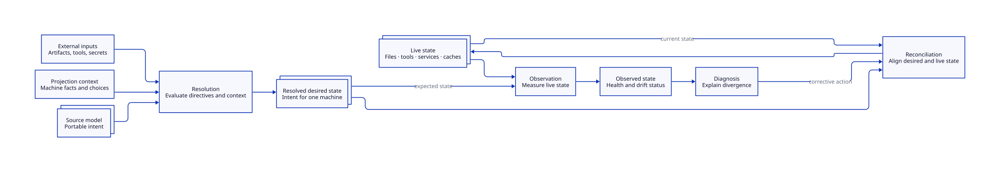

<p align="center">
  <h1 align="center">loklaan/dotfiles</h1>
  <p align="center">
    Cross-platform dev environment, one script away.<br>
    Managed with <a href="https://www.chezmoi.io/">chezmoi</a> · versioned with <a href="https://mise.jdx.dev/">mise</a> · secrets via <a href="https://bitwarden.com/help/secrets-manager-cli/">Bitwarden</a>
  </p>
  <p align="center">
    
    
    
    
  </p>
</p>

---

A single `install.sh` bootstraps a complete development environment from a clean machine — shell, git, dev tools, secrets, and AI assistant configuration. Everything is templated, idempotent, and version-locked so the same setup reproduces identically across personal laptops, work machines, and ephemeral dev containers.

Chezmoi manages the file lifecycle: Go templates resolve per-machine configuration at apply time, externals pin plugin archives to exact versions, and numbered scripts handle post-install automation in dependency order. Secrets never touch the repo — Bitwarden Secrets Manager provides them at render time through a token-gated guard pattern that degrades gracefully when credentials aren't available.

## System Model

This repository projects a portable desired-state model into a live user
environment. It resolves machine-specific variation, reconciles file and
operational state, and observes whether the machine has converged.

<p align="center">
  <a href=".agents/resources/system-model.md">
    <picture>
      <source media="(prefers-color-scheme: dark)" srcset="support/diagram-system-model-dark.svg">
      
    </picture>
  </a>
</p>

See the [Dotfiles System Model](.agents/resources/system-model.md) for the
concepts and invariants that should survive changes to the underlying tools.

## Features

<p align="center">
  <picture>
    <source media="(prefers-color-scheme: dark)" srcset="support/diagram-dark.svg">
    
  </picture>
</p>

## Install

```text
Usage:
  install.sh [OPTIONS]

Description:
  Installs dotfiles and packages.

Environment Variables:
  DEBUG:                     Set to 1 to enable command tracing (set -x) in logs.
  CONFIG_BWS_ACCESS_TOKEN:   Optional. Bitwarden Secrets access token.
                             When empty, prompts interactively (or skips if non-TTY).
  CONFIG_SIGNING_KEY:        Optional. The primary key of the signing GPG keypair.
                             When empty, commit signing is disabled.
  CONFIG_GH_USER:            Dotfiles GitHub user. (default: loklaan)
  CONFIG_EMAIL:              Personal email for Git. (default: bunn@lochlan.io)
  CONFIG_EMAIL_WORK:         Work email for Git. (default: lochlan@canva.com)

Options:
  --help:                    Display this help message
```

### Full Install

_(inc. chezmoi, bitwarden, mise)_

```shell
# Clone to chezmoi's source directory
git clone https://github.com/loklaan/dotfiles.git ~/.local/share/chezmoi

# Run install (will prompt for BWS token interactively)
~/.local/share/chezmoi/install.sh

# Or non-interactive (CI, Docker, etc.)
CONFIG_BWS_ACCESS_TOKEN=... CONFIG_SIGNING_KEY=... ~/.local/share/chezmoi/install.sh
```

### Quick Install (curl)

```shell
curl -fsSL https://raw.githubusercontent.com/loklaan/dotfiles/main/install.sh | bash
```

### Update to Latest

```shell
# Safe for re-runs, to keep devbox provisioning idempotent:
~/.local/share/chezmoi/install.sh

# Or:
chezmoi update
```

### Testing the Install

Validate installation in a clean environment:

```shell
./install.test.sh
```

Runs end-to-end installation test in Docker (Alpine Linux) with dummy data from `chezmoi.test.toml`.

## Secret Management

Secrets are stored in [Bitwarden Secrets Manager](https://bitwarden.com/help/secrets-manager-cli/) and fetched at template render time. Each machine stores its BWS access token locally (`~/.config/chezmoi/secrets/bws-access-token.txt`, mode 0600). Templates call the `bws-get-or-empty` wrapper with a secret ID and token-file path to resolve secret values during `chezmoi apply`.

See `.agents/rules/secrets-architecture.md` for detailed architecture documentation.

## Per-machine MCP executables

The versioned source owns the standard MCPProxy servers. Add a privileged
stdio executable without committing its source, URL, or credentials by editing
the machine-local chezmoi config (`chezmoi edit-config`):

```toml
[data.mcpStdioServers.private-service]
command = "/bin/sh"
args = ["-c", "exec /path/to/private-service-mcp"]

# Optional mcpproxy fields
enabled = true
init_timeout = "60s"

[data.mcpStdioServers.private-service.env]
PRIVATE_SERVICE_TOKEN = "..."
```

Each table name becomes the MCP server name. The collection always renders as
`protocol = "stdio"`; `args` defaults to an empty list and `enabled` to true.
The entry must define `command` and cannot reuse a dotfiles-managed server
name. Re-run `chezmoi apply` after changing it; the existing MCPProxy lifecycle
reloads the rendered config.

## Structure

```
home/
├── .chezmoiexternals/          # External deps (plugins, fonts) via archives
├── .chezmoiscripts/            # Pre & post-install automation scripts
├── dev/                        # Code projects
├── private_dot_config/
│   ├── private_zsh/            # Modular zsh configuration
│   │   ├── init/               # Startup modules (env, login, options, plugins, prompt)
│   │   └── plugins/            # Vendored plugin configs (starship, ghostty, clipboard)
│   └── ...                     # Other tool configs
└── private_dot_local/bin/      # Custom utilities
```

## Code Agent Adoption

Claude Code and OpenCode share a vendor-neutral set of rules and [Agent Skills](https://agentskills.io) under `~/.agents/`, with vendor-specific paths (`~/.claude/`, `~/.config/opencode/`) symlinking into it. Skills are auto-packed into zips for reuse in Claude Chat, and are designed to port cleanly across vendors.

<p align="center">
  <picture>
    <source media="(prefers-color-scheme: dark)" srcset="support/diagram-agent-dark.svg">
    
  </picture>
</p>

### Skill Lifecycle

Chezmoi resolves repository defaults together with machine-local
`skillSources`, `skillProviders`, and `skills` data into one private schema-2
manifest. It owns acquisition and materialization: repository skills are normal
chezmoi files, Git sources are chezmoi externals at locked revisions, and archive
sources are exact checksum-pinned raw inputs. `df-skills` does not fetch or reset
those sources and never recursively invokes chezmoi from an apply hook.

`df-skills` reconciles the resolved manifest after materialization. It owns only
the child links and derived archive trees recorded in its private mode-0600
receipt. `~/.agents/skills` remains a physical mixed-owner directory; unknown
siblings and changed foreign links are preserved. A desired collision is an
actionable boundary, not permission to claim the whole registry.

Provider filesystem targets stay in their native storage and are never copied
or deleted. Command providers and workflow packs have no filesystem projection.
Failures are reported after unrelated safe reconciliation: a missing provider
does not block repository links, packaging cannot change links, and Effect
reference health is independent of skills.

Machine-local configuration may add filesystem, Git, or archive sources and
command or pack providers without committing credentials, URLs, or
provider-specific identities. Platform and profile gates are resolved while the
manifest is rendered; inactive entries do not reach the runtime manifest.
Use only placeholder domains and IDs in shared documentation:

```toml
[data.skillSources.local-repository]
id = "local-repository"
kind = "repository"
path = "{homeDir}/.local/share/dotfiles/skills"
platforms = []
profiles = []
items = ["example:local"]

[data.skillSources.team-git]
id = "team-git"
kind = "git"
path = "{homeDir}/.local/share/dotfiles/skills/team-git"
url = "https://git.example.invalid/skills.git"
platforms = []
profiles = []
transforms = []
items = [{ id = "example:git", directory = "example:git", package = false }]

[data.skillSources.team-git.lock]
ref = "release"
refPolicy = "tag"
revision = "0123456789abcdef0123456789abcdef01234567"
```

Archive sources bind the acquisition checksum, content digest, and immutable
revision. Chezmoi acquires an **exact raw archive tree** beneath the private
`.inputs/<id>/` area, so members removed upstream also leave the input tree.
`df-skills` validates that input, applies only the declared frontmatter or
logical-directory transforms in temporary storage, and atomically publishes the
complete derived tree. Removal requires an unchanged receipt-owned tree.
Unknown or modified output is preserved and reported as drift, while raw inputs
remain under chezmoi's separate acquisition ownership.
Git sources bind both the declared ref and its resolved revision.
Repository targets are content-hashed during observation; they do not acquire a
remote. Each item is a string ID or a table with `id`, `directory`, and
`package`; the boolean is deliberately asymmetric: every selected item gets an
individual registry link, while only `package = true` enters the archive
inventory.
Use `directory = "."` when the source root is itself the selected skill.

For provider-native content, declare `kind = "filesystem"`, an absolute native
`path`, a content-hash lock, and explicit items. Package eligibility defaults to
false. Existing machine-local repository declarations outside the dotfiles store
normalize to filesystem entries for compatibility; they do not acquire or copy
content. Use explicit filesystem declarations rather than discovering intent
from live files.

Provider contracts are explicit and mutually exclusive:

| Provider kind | Required capabilities | Item fields | Observation result |
|---|---|---|---|
| `command` | `version`, `observe`, `sync`, `enable`, `disable` | `id` | Selected IDs |
| `pack` | `version`, `observe`, `install`, `update`, `remove` | `id`, `source`, `removeAs` | Installed pack IDs |

Pack `update` is never automatic by default. Opting into `exclusive = true`
requires the observation to contain no unmanaged packs before a provider-wide
update is permitted. Individual installs/removals remain receipt-owned. Command
and pack items cannot be packaged because their contracts expose no stable
file-backed target.

```toml
[data.skillProviders.example-command]
id = "example-command"
kind = "command"
platforms = []
profiles = []

[data.skillProviders.example-command.lock]
executable = "example-provider"
version = "1.0.0"

[data.skillProviders.example-command.version]
argv = ["example-provider", "--version"]

[data.skillProviders.example-command.observe]
argv = ["example-provider", "list", "--json"]
selector = ".items"
timeoutSeconds = 30
maxOutputBytes = 1048576

[data.skillProviders.example-command.sync]
argv = ["example-provider", "sync"]

[data.skillProviders.example-command.enable]
argv = ["example-provider", "enable", "{id}"]

[data.skillProviders.example-command.disable]
argv = ["example-provider", "disable", "{id}"]

[data.skillProviders.example-pack]
id = "example-pack"
kind = "pack"
platforms = []
profiles = []

[data.skillProviders.example-pack.lock]
executable = "example-packs"
version = "1.0.0"
identity = "example-packs.lock"

[data.skillProviders.example-pack.version]
argv = ["example-packs", "--version"]

[data.skillProviders.example-pack.observe]
argv = ["example-packs", "list", "--json"]
selector = ".items"

[data.skillProviders.example-pack.install]
argv = ["example-packs", "install", "{source}"]

[data.skillProviders.example-pack.update]
argv = ["example-packs", "update"]

[data.skillProviders.example-pack.remove]
argv = ["example-packs", "remove", "{removeAs}"]

[data.skills]
example-command = ["example:command"]
example-pack = [{ id = "example:pack", source = "example/pack", removeAs = "example-pack" }]
```

An empty platform or profile list applies everywhere. A non-empty list is an
opt-in gate resolved by the manifest template. Use `df-skills plan`, `observe`,
`reconcile`, or `package` for the four operations. `plan` and `observe` are
read-only. Reconciliation records one pending provider mutation before invoking
the provider and resolves it from native observation after interruption.

Apply ordering is acquisition/materialization, reconcile, package, then final
observe. Reconcile deliberately ignores expected package drift through its
`reconcileHealthy` result so packaging still runs. Package failure remains
nonzero but does not suppress final observe diagnostics. `df-setup` decodes the
same observe envelope and reports one actionable source, provider, registry,
package, ownership, or reference boundary.

| Surface | Managed contract | Explicit exclusion |
|---|---|---|
| Repository source | Chezmoi materializes the physical skill in the stable dotfiles store | No runtime source-tree copy or network acquisition |
| Archive source | Chezmoi acquires an exact private raw tree; `df-skills` atomically publishes the receipt-owned derived item | No archive downloads or in-place source patching by `df-skills` |
| Git source | Chezmoi owns the stable checkout; observation verifies origin, ref, revision, and clean worktree | `df-skills` does not fetch or reset Git |
| Provider filesystem | Individual registry link to a validated native target | Provider content is never copied or removed |
| Vendor projections | Claude, OpenCode, and Otter skill paths select the physical registry | No vendor-specific copies or whole-registry ownership |
| Packaging | Explicit eligible file-backed links have deterministic receipt-owned ZIP archives | Ineligible skills and command/pack runtime state are never archived |
| Provider/session/auth | Provider `observe` is bounded and read-only | Plugins, auth credentials, and session state are not lifecycle-managed |

Effect v4 documentation and source are deliberately outside this skill
lifecycle. The hidden `effect-v4:install` mise task installs one checksum-pinned
upstream tree at `~/.local/share/mise/effect-v4-reference/current`; OpenCode 1
and 2 advertise that same local directory as `@effect-v4` and read files only
when requested. `df-setup` reports a missing or stale artifact. The reference
never enters a skill/config tree or executable PATH.

## Code Projects

The `~/dev/` directory organizes projects by ownership and purpose:

- **`~/dev/canva/`** - Work projects—I work at Canva! [Come join!](http://lifeatcanva.com/)
- **`~/dev/me/`** - Personal projects.
- **`~/dev/open/`** - Open source projects. Others, usually.

In repos where I actively develop, I may include a `.me/` directory for helpful scripts, temporary data or jupyter notebooks, etc. These are not managed by chezmoi, and are gitignored globally.
